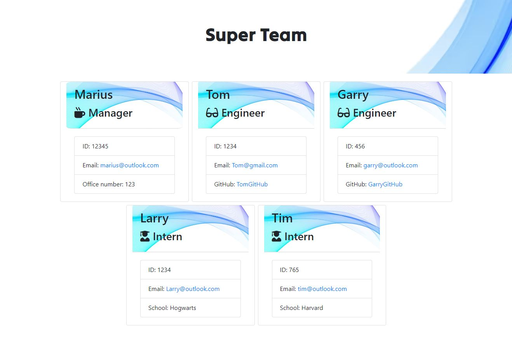

# Build Team Profile    

Node.js CLI application that generates team HTML page. 

## Description
This is Command Line Interface application that creates html page containing information about the team members, after answered prompted question in CLI. This project was created using node.js. Styling was done with bootstrap.

## Table of content
- [Installation](#Installation)
- [Usage](#Usage)
- [License](#License)
- [Tests](#Tests)
- [Questions](#Questions)

## Images of my application

#### Command line interface

#### Screenshot of HTML result page

## Installation
You have to have node.js installed on your machine

=> npm install

## Usage
+ Open command line
+ Answer prompted questions about your team
+ result is in output/team.html

## License

MIT License

Copyright (c) 2023 MarKubil

Permission is hereby granted, free of charge, to any person obtaining a copy
of this software and associated documentation files (the "Software"), to deal
in the Software without restriction, including without limitation the rights
to use, copy, modify, merge, publish, distribute, sublicense, and/or sell
copies of the Software, and to permit persons to whom the Software is
furnished to do so, subject to the following conditions:

The above copyright notice and this permission notice shall be included in all
copies or substantial portions of the Software.

THE SOFTWARE IS PROVIDED "AS IS", WITHOUT WARRANTY OF ANY KIND, EXPRESS OR
IMPLIED, INCLUDING BUT NOT LIMITED TO THE WARRANTIES OF MERCHANTABILITY,
FITNESS FOR A PARTICULAR PURPOSE AND NONINFRINGEMENT. IN NO EVENT SHALL THE
AUTHORS OR COPYRIGHT HOLDERS BE LIABLE FOR ANY CLAIM, DAMAGES OR OTHER
LIABILITY, WHETHER IN AN ACTION OF CONTRACT, TORT OR OTHERWISE, ARISING FROM,
OUT OF OR IN CONNECTION WITH THE SOFTWARE OR THE USE OR OTHER DEALINGS IN THE
SOFTWARE.

## Tests
=> npm run test

## Questions
If you have any questions about the project, contact me directly at [email](marius.kub@outlook.com).

You can find more of my work at [MarKubil](https://github.com/MarKubil/).